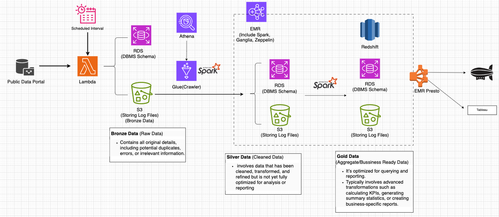
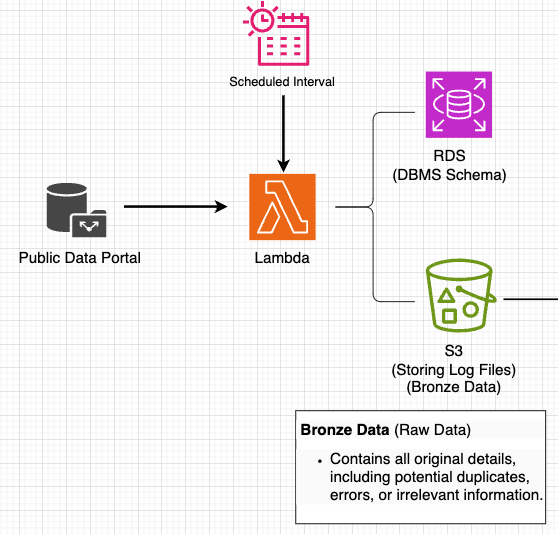
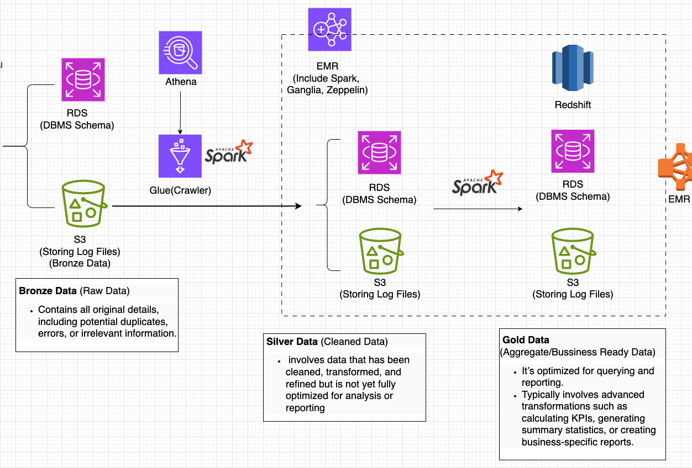

# AWS-Data-Processing
This repository contains the implementation of a scalable and robust data processing pipeline designed to extract, transform, and load (ETL) data from public data portals into structured, optimized formats for analysis and reporting. The project leverages modern cloud technologies and big data tools for efficient processing.

- Data Source: The pipeline fetches real estate transaction records from a public data portal, which provides data related to Seoul's real estate market. The records include various property categories such as Apartments, Houses, Land, and Other property types.


### Overview


### The data processing pipeline follows a three-tier architecture:
- Bronze Data: Raw data containing duplicates, errors, or irrelevant information.
- Silver Data: Cleaned and transformed data, refined but not yet fully optimized for analysis.
- Gold Data: Fully processed and business-ready data for analytics, reporting, and KPI generation.

### Part.1



#### Ingestion Phase

**- Data Source:** Real estate transaction data is fetched from the public data portal at regular intervals.
**- AWS Lambda:** A Lambda function automates the data ingestion process, triggered at scheduled intervals to fetch data.

**Creating Bronze Data**

- **RDS Storage** The fetched data is stored in a relational database (RDS) in a structured format to maintain the initial database schema.

- **S3 Storage** Simultaneously, the data is saved in JSON format in an S3 bucket for raw data preservation.
    - This unprocessed data, referred to as Bronze Data, may include duplicates, errors, or irrelevant information.

### Part.2


### Transformation Phase: Cataloging Data with AWS Glue

**AWS Glue Crawler**
- Crawlers automatically scan the S3 bucket containing Bronze Data to generate metadata tables in the Glue Data Catalog. This simplifies schema discovery and management.

- The crawler process the file in CSV, Parquet, and JSON formats in the Silver Data tier for efficient storage and analysis.


**AWS Glue as a Metadata Store**
- AWS Glue serves as the metadata store for Apache Spark on EMR. It maintains schemas and metadata for raw data stored in S3, enabling Spark jobs to efficiently query and process data.


### Preprocessing with Apache Spark on EMR

**Apache Spark on EMR**
 - Data is preprocessed and transformed using Spark on an EMR cluster.

**Key preprocessing steps include**
- Cleaning raw data to remove duplicates, errors, and irrelevant information.
- Standardizing and transforming data to prepare Silver Data.
- A table is created in a relational database (RDS) specifically for apartment transaction records, ensuring structured storage for this category.
```
%sql
-- table for number of view per village 

CREATE EXTERNAL TABLE  story_data.apart_user_view_silver
(
  adid string, 
  apart_id string,
  base_dt string
)
PARTITIONED BY ( 
  base_date date )
STORED AS PARQUET
LOCATION 's3://dataeng-handson/silver/danji_user_view_silver'
tblproperties ("parquet.compress"="SNAPPY" ,"classification"="parquet")
;
```
```
%sql
insert overwrite table story_data.apart_user_view_silver
    PARTITION(base_date)  
select 
adid,
building_id as apart_id,
timestamp as base_dt,
to_date(base_date, 'yyyy-MM-dd') as base_date 
from story_data.applog
where item_category = 'apartment'
 and building_id != '0'
 and building_id != 'NULL'
```


**Processed Silver Data is stored**
- In S3: 
    - For scalable storage and intermediate processing.
    - AWS Glue serves as the metadata store for Apache Spark on EMR. While the actual data is stored in S3
- In RDS: For structured queries and further transformation.

### Data Processing Workflow: Gold Data Creation
**Transforming and Joining Tables**

- Apache Spark on EMR: After preprocessing and cleaning the data into Silver Data, advanced transformations are performed to generate Gold Data.

- Joining Tables: Relevant tables from the Silver Data layer are joined to create aggregated datasets.
``` 
%sql
//Create a table for gold dataset.

create external table story_data.apart_user_view_summary
 (
      base_date string, 
      apart_id string, 
      danji_name string,
      sido string,
      sigungu string,
      dong string,
      view_count int
 )
 STORED AS PARQUET
 LOCATION 's3://dataeng-handson/gold/apart_user_view_summary'
 tblproperties ("parquet.compress"="SNAPPY" ,"classification"="parquet")
```

```
%sql
insert overwrite table story_data.apart_view_summary
select a.base_date, 
       a.apart_id, 
       b.danji_name,
       b.sido,
       b.sigungu,
       b.dong,
       count(*) as view_count
from story_data.apart_user_view_silver a 
join `handson-db `.`fc-parquet` b
on a.apart_id = b.id 
group by a.base_date, 
       a.apart_id, 
       b.danji_name,
       b.sido,
       b.sigungu,
       b.dong
order by count(*) desc
```
